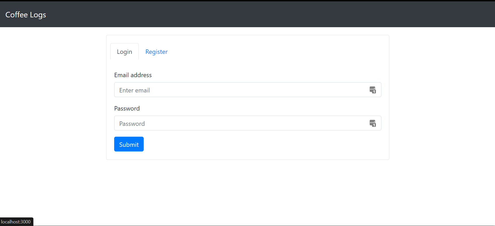
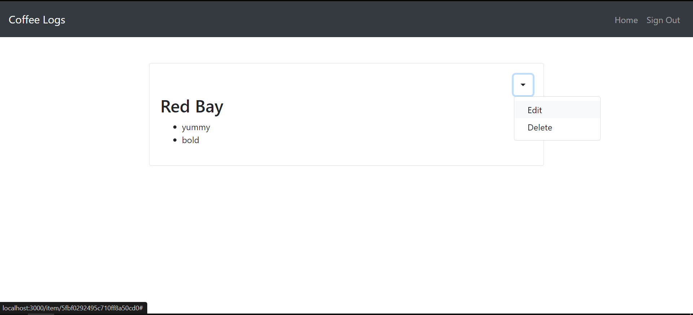
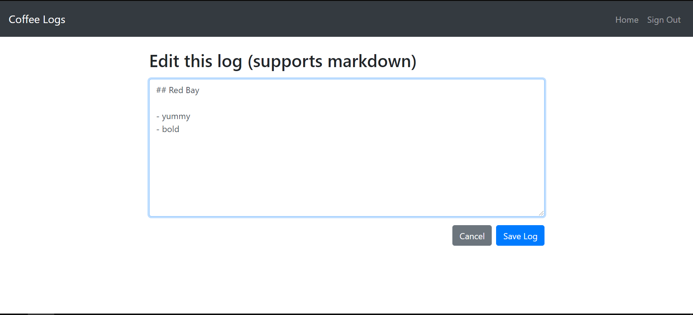

<br>

# Coffee Logs

### Description:

A web app to keep track of coffee roasts. Users can use markdown to create, edit and delete coffee "logs" using markdown for text formatting.

<br>

<p float="left">
  
  
  
</p>

### Motivation:

I needed a way to keep track of new coffee roasts I am trying out. I wanted to be able to use markdown to format entries.

<br>

### Technologies:

<ul>
<li>Node</li>
<li>MongoDB</li>
<li>Express</li>
<li>React</li>
</ul>

### Setup:

- Clone to computer and
- Navigate to directory
- Run `npm install`
- Create a .env file
- Fill contents with:

```
JWT_TOKEN=choose_any_secret
```
